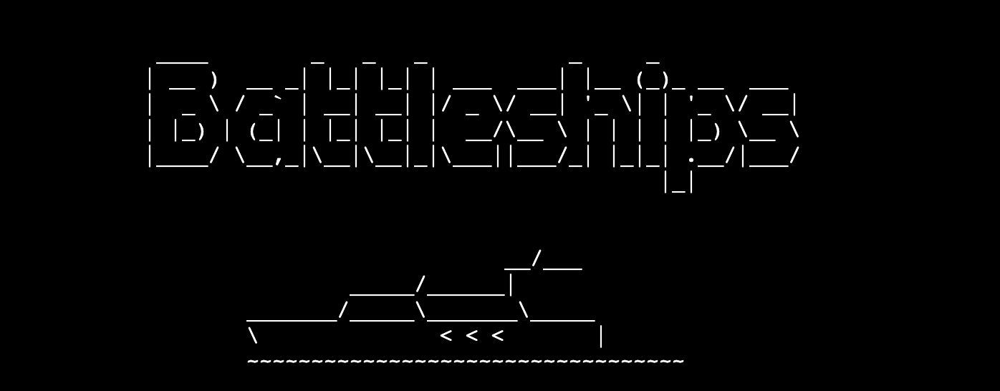

# Battleships Game

This is a Battleships game! You can play this game in the terminal, and it works like a charm!  
It was built using Python to showcase its capabilities with a gaming approach. The game allows users to interact within the terminal and provide appropriate feedback based on their actions.  
The game itself is simplified, requiring players to guess the opponent's ships. To add challenge, there's a limit  
to the number of wrong guesses allowed before losing.  
Sink your opponent's ship and sail away for victory! [play now](https://battleships-game-ci-6a2a2f14ab3d.herokuapp.com/)
___
