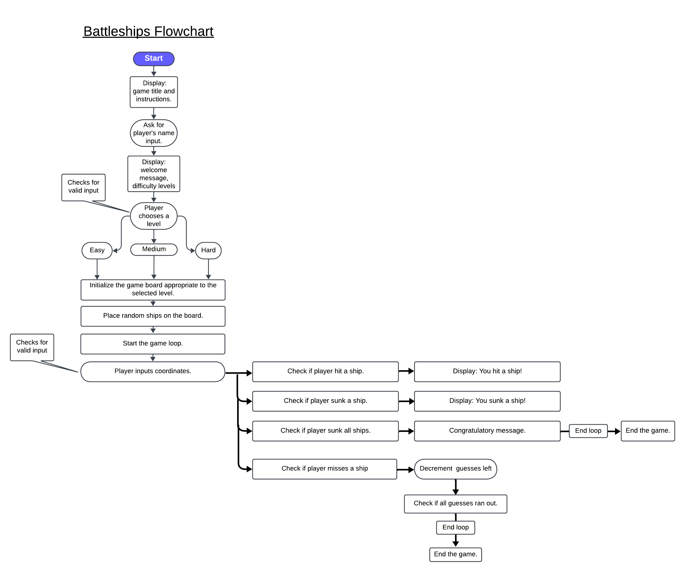

# Battleships Game

This is a Battleships game! You can play this game in the terminal, and it works like a charm!  
It was built using Python to showcase its capabilities with a gaming approach.  
The game allows users to interact within the terminal and provide appropriate feedback based on their actions.  
The game itself is simplified, requiring players to guess the opponent's ships. To add challenge,
there's a limit to the number of wrong guesses allowed before losing.  
Sink your opponent's ship and sail away for victory! [play now](https://battleships-game-ci-6a2a2f14ab3d.herokuapp.com/)
___

# User Experience (UX)
## User stories
- As a player, I am greeted with the home screen of the game.
- As a player, I can type in required text to begin the game.
- As a player, I can read through the instructions of the game.
- As a player, I can type in my name to personalize my gaming experience.
- As a player, I can easily choose between different levels of difficulty.
- As a player, I can easily recognize and understamd the various aspects of the game.
- As a player, I can utilize vaious input methods to determine an outcome.
- As a player, I am given a game over or congratulatory message upon conditions being met.
___

# Game Logic Flowchart 
 
The game development process was optimized using this flowchart, providing a strong foundation for the Battleships game logic.
___
