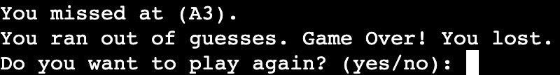

# Battleships Game

This is a Battleships game! You can play this game in the terminal, and it works like a charm!  
It was built using Python to showcase its capabilities with a gaming approach.  
The game allows users to interact within the terminal and provide appropriate feedback based on their actions.  
The game itself is simplified, requiring players to guess the opponent's ships. To add challenge,
there's a limit to the number of wrong guesses allowed before losing.  
Sink your opponent's ship and sail away for victory! [play now](https://battleships-game-ci-6a2a2f14ab3d.herokuapp.com/)
___

# User Experience (UX)
## User stories
- As a player, I am greeted with the home screen of the game.
- As a player, I can type in required text to begin the game.
- As a player, I can read through the instructions of the game.
- As a player, I can type in my name to personalize my gaming experience.
- As a player, I can easily choose between different levels of difficulty.
- As a player, I can easily recognize and understamd the various aspects of the game.
- As a player, I can utilize vaious input methods to determine an outcome.
- As a player, I am given a game over or congratulatory message upon conditions being met.
___

# Game Logic Flowchart 
 
The game development process was optimized using this flowchart, providing a strong foundation for the Battleships game logic.
___

# Features
## ASCII Images
  
These are ASCII art to give the start menu some visual flare.  
The title of the game and thr battleship art is written in ASCII format, therefore meeting the theme of this project.

## Game Interaction
  
The user has to type in 'play' to enter into game state,  
otherwise the user can't start the game. This makes the the start menu less cluttered,  
while providing a seamless transition to game enviroment from start menu.  
The keyword 'play' can be typed in lowercase or uppercase, anything else will trigger an invalid input.

 
The users are greeted with the game instructions displayed in the initila text box.  
This section serves as an introduction to the game, informing the users of objectives, rules and outcome.

  
Below the instructions section is the player name input field. The user may enter their name as they please,
but can't leave it empty or else a validation erorr triggers, asking users to enter a name. 

  
After inputting their name, the user is greeted by their provided name. At this point, the user has the  
option to select their preferred difficulty level for gameplay.  
- 'e' for easy
- 'm' for medium
- 'h' for hard    

Any other input will cause a validation error and requesting user to type again.

  
This interface provides all the key elements essential for a intuitive battleships gaming experience.  
These include: 
- Game board : Visual representation of the battlefield where the player can track of hits or misses on ships.
- Coordinates label : Indicates the accurate coordinates for the players to make guesses.
- Wrong guesses counter : Decreases by 1 with each incorrect guesses until it reaches 0, then the game ends.
- Difficulty level: Reminds player of the chosen level.
- Player input field for guessing ships: Allows players to enter coordinates within the board's range.

  
The player will be informed with a messsage on a ship being missed with the appropriate coordinates.  

  
The player will be informed with a messsage on a ship being hit with the appropriate coordinates.  

  
The player will be informed with a messsage on a ship being sunk.  

  
The player will be congratulated after sinking all the ships. This message marks the end of the game.

  
The player will be informed of losing the game, and given options to start over or exit out of the game.  

___

# Testing 
## Manual Testing
| Browser Testing | Supported |
|-----------------|-----------|
| Chrome          | &check;   |
| Firefox         | &check;   |
| Safari          | It doesn't contain the necessary js. script to run the app. |

### Validator Testing
  
There were some errors regarding whitespaces & length of code being over 79 characters long,  
fortunetely they have all been resolved.

### Gameplay
| Scenario | Action | Expected Outcome | Actual Outcome |
|----------|--------|------------------|----------------|
| Initialize of the game | Player types in the keyword 'play'| The game content is being displayed | True |
| Player Registration | Player enters their name | Welcome message with the player's name is displayed | True |
| Selecting Game Difficulty | Player enters a specific letter | The board initializes with a specific layout corresponding to the chosen difficulty | True |
| Guessing the ships | Player enters a set of coordinates | The board updates with the mark of 'U' if the coordinates correspond to a ship, otherwise 'X' as miss. | True |
| Reguessing the coordinates | Player enters the same coordinates multiple times | An invalid message triggers | True |
| Entering Far-Reaching coordinates | Player enters coordinates outside the game board | An invalid message triggers | True |
| Entering Invalid coordinates | Player enters just anything not related to game | An invalid message triggers | True |
| Ship sinks after 3rd hit | Player hits all three parts of the ship | Ship sunk message triggers | True |
| Game loss | Player uses all remaining wrong guesses | The game ends and displays a 'Game Over' message with options to start over or exit | True |
| Game win | Player successfully sinks all ships | The game ends with a congratulatory message and starts over the game | True |

